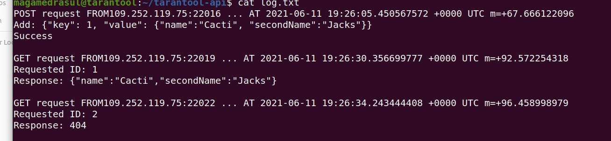

# tarantool-rest-api

REST API доступен по адресу http://35.246.166.66/kv

- POST /kv body: {"key": 1, "value": {"name": "Name", "secondName": "secondName"}} 
- PUT kv/{id} body: {"value": {"name": "Name", "secondName": "secondName"}} 
- GET kv/{id} 
- DELETE kv/{id} 
- POST возвращает 409 если ключ уже существует, 
- POST, PUT возвращают 400 если боди некорректное 
- PUT, GET, DELETE возвращает 404 если такого ключа нет - все операции логируются

формат спейса : {id unsigned, map{name, secondName}}

логфайл хранится на сервере, 

настройка Tarantool:
```bash
tarantool
box.schema.user.passwd('pass')
box.schema.space.create("mail")
s = box.space.mail
s:format({
	{name = 'id', type = 'unsigned'},
	{name = 'val', type = 'map'}
})
s:create_index('primary', {
	type = 'hash',
	parts = {'id'}
})
```

Запуск Tarantool как демона: <br>
В файл app.lua добавляем:
	box.cfg {
		listen = 3311,
		background = true,
		log = '1.log',
		pid_file = '1.pid'
	}

Запуск Tarantool как демона на localhost:3311:
```bash
tarantool app.lua
```

Запуск сервера (подключается к Tarantool по localhost:3311)
```bash
go build main.go utils.go structs.go api.go
./main
```

api.go содержит обработку всех запросов

Пример запроса:<br>
	POST /kv body: {"key": 10, "value": {"name": "Mail", "secondName": "Ru"}} <br>
	GET /kv/{10} , где id = 10 - query parameter<br>
	DELETE /kv/{10}, где id = 10 - query parameter<br>
	PUT kv/{10} , где id = 10 - query parameter, body : {"name" : "New", "secondName": "data"}<br>

http://35.246.166.66/kv?id=1
